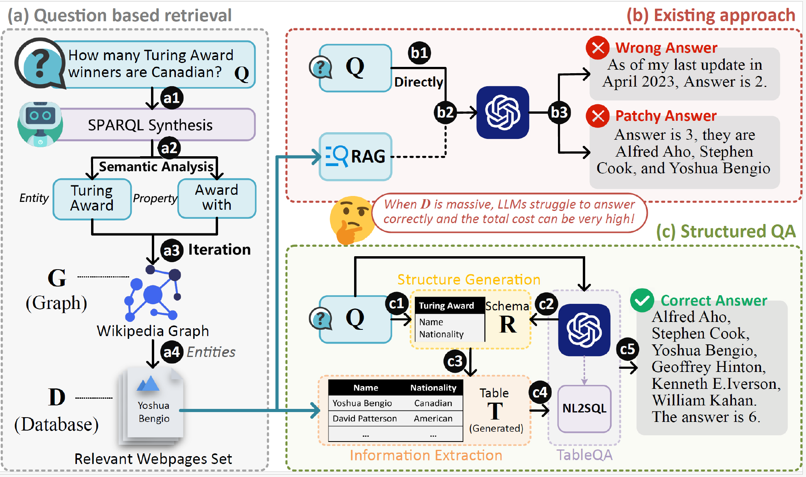

# SRAG

## 👀Overview
This repository contains code for our paper. We propose Structured RAG (SRAG) – a novel framework that systematically organizes extracted entities into relational tables and leverages table-based reasoning. By decoupling retrieval from structured analysis, SRAG enables focused reasoning over organized data rather than raw text. Our experiments on Wikipedia-based MEQA tasks demonstrate a 29.6% accuracy improvement over state-of-the-art RAG and long-context LLMs, proving that structured data transformation fundamentally enhances LLMs' reasoning capabilities.

**SRAG pipeline**

  

## 📦 Dataset
**[👉 Access the MEBench dataset 👈](https://github.com/tl2309/SRAG/tree/main/MEBench)**

## 🔧Evaluate 

